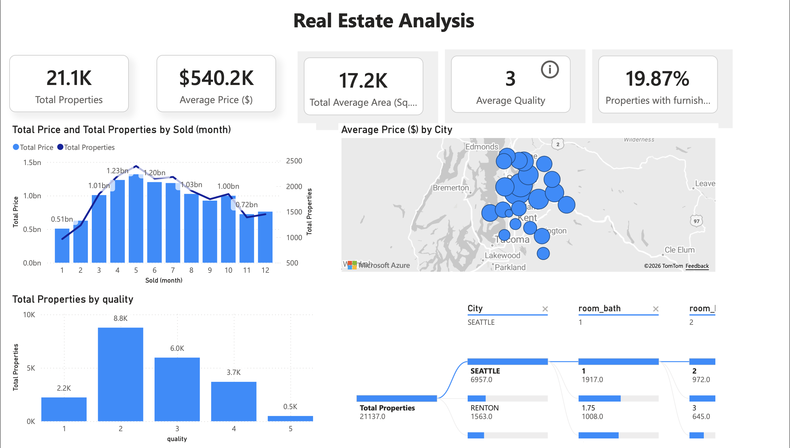

# Residential Real Estate Market Analysis – Power BI Dashboard

## Business Context

The U.S. residential real estate market has experienced significant price growth driven by strong demand and changing economic conditions. 

As a leading real estate company operating in the residential segment, the organization aims to leverage data analytics to identify high-value opportunities, understand pricing trends, and make informed property investment decisions.

This dashboard was developed to provide senior management with actionable insights into housing prices, property characteristics, and regional performance trends.

---

## Objective

The primary objectives of this analysis are to:

- Analyze housing price trends across cities and months
- Identify high-performing property segments
- Understand the relationship between property quality, size, and pricing
- Evaluate regional pricing patterns
- Support data-driven property acquisition decisions

---

## Key KPIs

- **Total Properties:** 21,100  
- **Average Property Price:** $540,200  
- **Average Area:** 17,200 sq ft  
- **Average Quality Rating:** 3  
- **Furnished Properties:** 19.87%

---

## Dashboard Highlights

### 1️⃣ Sales Trends
- Monthly total price and total properties sold
- Identification of seasonal demand patterns

### 2️⃣ Geographic Pricing Analysis
- Interactive city-level pricing map
- Visual comparison of average prices by location

### 3️⃣ Property Quality Distribution
- Breakdown of properties by quality rating
- Insight into which quality segments dominate the market

### 4️⃣ Property Segmentation Analysis
- City, number of bathrooms, and room filters
- Flow-based analysis of property distribution across segments

---

## Tools & Technologies

- **Power BI Desktop**
- DAX Measures
- Data Modeling
- Interactive Slicers
- Azure Map Visual

---

## Dashboard Preview

## Repository Contents

- `RealEstateAnalysis.pbix` – Power BI dashboard file  
- `images/` – Dashboard screenshots  
- `README.md` – Project documentation  

---

## Business Impact

This dashboard enables leadership to:

- Identify profitable property segments
- Optimize pricing strategy
- Target high-demand locations
- Make informed acquisition decisions
